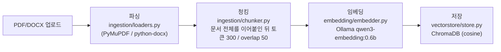
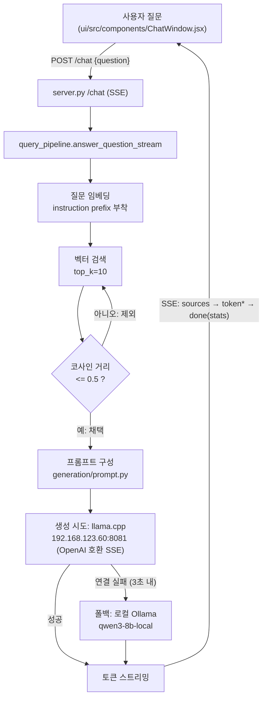

# RAG 챗봇 구현 정리

## 시스템 흐름도

### 1. 인덱싱 흐름 (문서 업로드 시, 오프라인)



- 진입점: UI에서 파일 첨부 후 전송 → `POST /upload`, 또는 CLI `python main.py index <경로>`
- 파이프라인 함수: `pipeline/index_pipeline.py`의 `index_file()` / `index_directory()`

### 2. 질의 흐름 (사용자가 질문할 때, 매 요청마다)



- 첫 질문일 경우 별도로 `POST /title`을 호출해 질문의 핵심 주제를 짧게 요약, 채팅 제목으로 사용

## 기술 스택

| 단계 | 구현 | 세부 |
|---|---|---|
| PDF 파싱 | PyMuPDF (`fitz`) | 페이지 단위 텍스트 + 페이지 번호 메타데이터 |
| DOCX 파싱 | python-docx | 문단 단위 텍스트 결합 |
| 청킹 | langchain-text-splitters `RecursiveCharacterTextSplitter` | 토큰 300 / overlap 50, Qwen3-Embedding 토크나이저 기준 |
| 임베딩 | Qwen3-Embedding-0.6B | 로컬 Ollama API (`127.0.0.1:11434/api/embed`), 쿼리/문서 인코딩 함수 분리 |
| 벡터DB | ChromaDB | 파일 기반 `PersistentClient`, cosine space |
| 검색 | top_k=10, 코사인 거리 ≤ 0.5만 채택 | `retrieval/retriever.py` |
| 생성 (기본) | `Qwen3.6-35B-A3B-UD-Q4_K_XL.gguf` | llama.cpp 서버, OpenAI 호환 `/v1/chat/completions` SSE, n_ctx 65536 |
| 생성 (폴백) | `qwen3-8b-local` (Q4_K_M) | 로컬 Ollama, llama.cpp 연결 3초 내 실패 시 자동 전환, n_ctx 4096 |
| 채팅 제목 | 동일 생성 모델, 비스트리밍 | 질문 원문 대신 핵심 주제(2~6단어) 추출 |
| API 서버 | FastAPI + uvicorn (`server.py`) | `/chat`, `/upload`, `/index`, `/documents`, `/title`, `/models`, `/health` |
| 프론트엔드 | React + Vite + Tailwind v4 (`ui/`) | 채팅/프로젝트 사이드바 + 채팅창 + 문서 사이드바 3-패널 |

## 프로젝트 구조

```
ragchat/
├── requirements.txt
├── config.py                    # 모델명/엔드포인트, chunk size, top_k, 임계값 등 중앙 설정
├── Modelfile                    # 로컬 gguf를 Ollama 모델로 등록하기 위한 정의
├── ingestion/
│   ├── loaders.py                # PDF/DOCX → 텍스트 + 메타데이터(source, page)
│   └── chunker.py                # 문서 전체 이어붙여 토큰 청킹
├── embedding/
│   └── embedder.py               # Ollama qwen3-embedding:0.6b 호출, 쿼리/문서 인코딩 분리
├── vectorstore/
│   └── store.py                  # ChromaDB upsert/search/list/delete
├── retrieval/
│   └── retriever.py              # 질문 → 임베딩 → top-k 검색
├── generation/
│   ├── prompt.py                  # 시스템 프롬프트 + 컨텍스트 + 질문 조립
│   └── llm.py                     # 생성 호출(원격+로컬 폴백, 스트리밍) + 제목 생성(비스트리밍)
├── pipeline/
│   ├── index_pipeline.py          # 문서 → 파싱 → 청킹 → 임베딩 → 저장
│   └── query_pipeline.py          # 질문 → 검색 → 프롬프트 → LLM → 답변+출처
├── server.py                      # FastAPI: /chat, /upload, /index, /documents, /title, /models, /health
├── models/
│   └── Qwen3-8B-Q4_K_M.gguf      # 로컬 폴백용 원본 gguf
├── main.py                        # CLI: index / search / chat
└── ui/                            # React + Vite + Tailwind v4 프론트엔드
    └── src/
        ├── App.jsx                # 세션/프로젝트 상태, /chat 스트리밍 연결
        ├── components/
        │   ├── Sidebar.jsx         # 채팅 목록 + 프로젝트 그룹핑/드래그앤드롭
        │   ├── ChatWindow.jsx      # 메시지 스크롤 영역 + 입력창(오버레이)
        │   ├── RightSidebar.jsx    # 인덱싱된 문서 목록
        │   └── MessageBubble.jsx, ModelBadge.jsx, TypingIndicator.jsx
        └── lib/
            ├── api.js              # 백엔드 REST/SSE 호출
            └── storage.js          # 세션/프로젝트 localStorage 저장
```